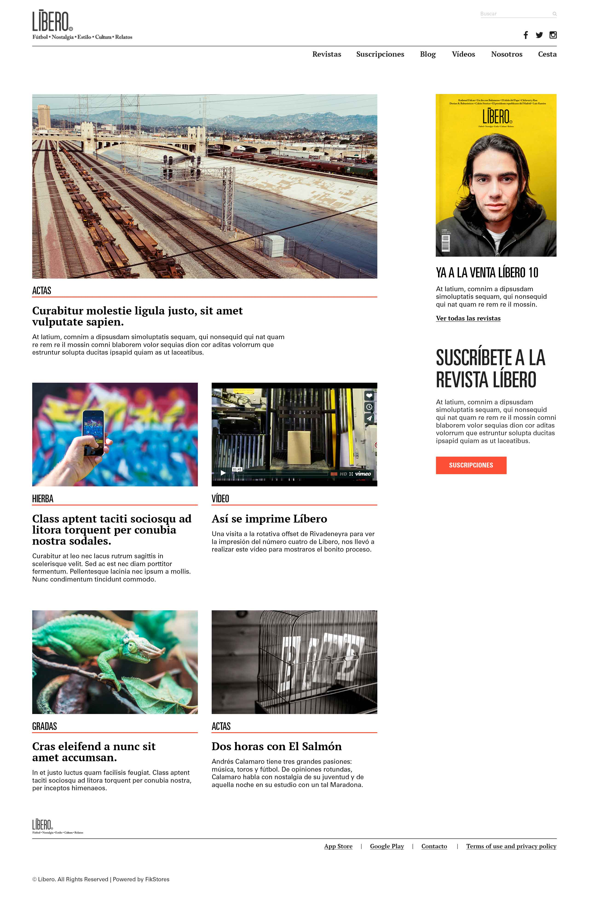
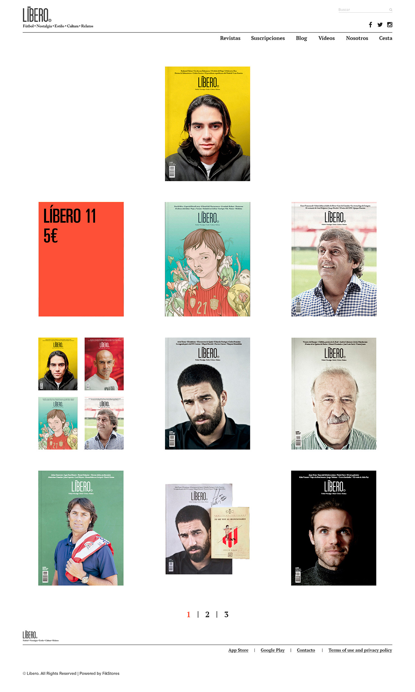
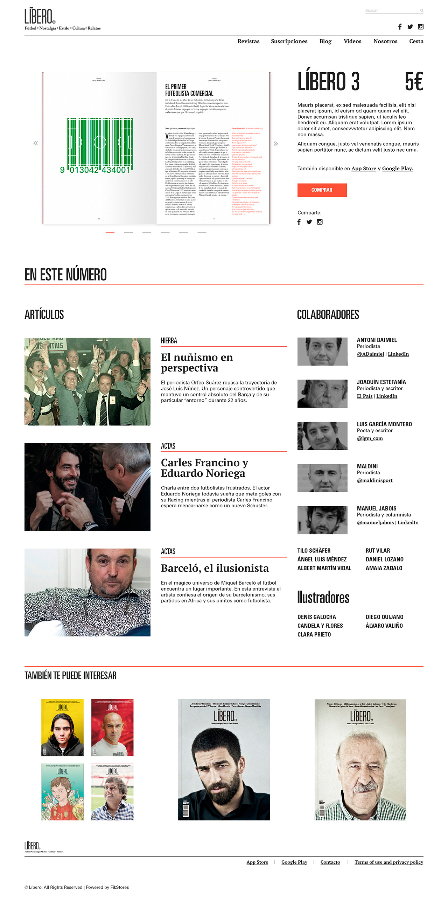
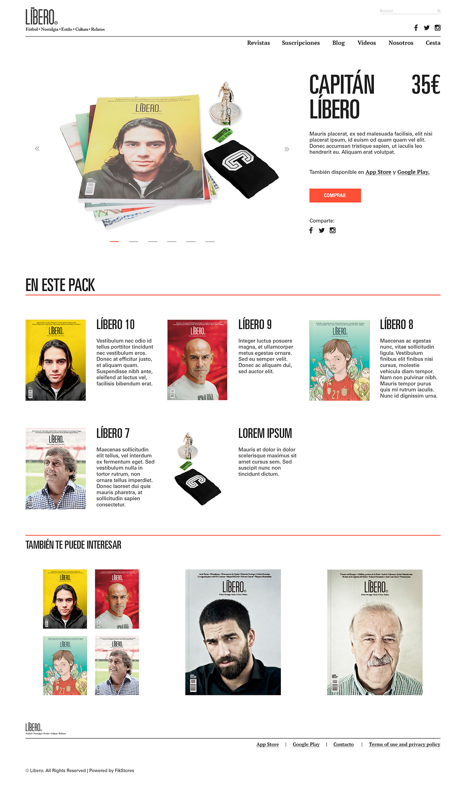
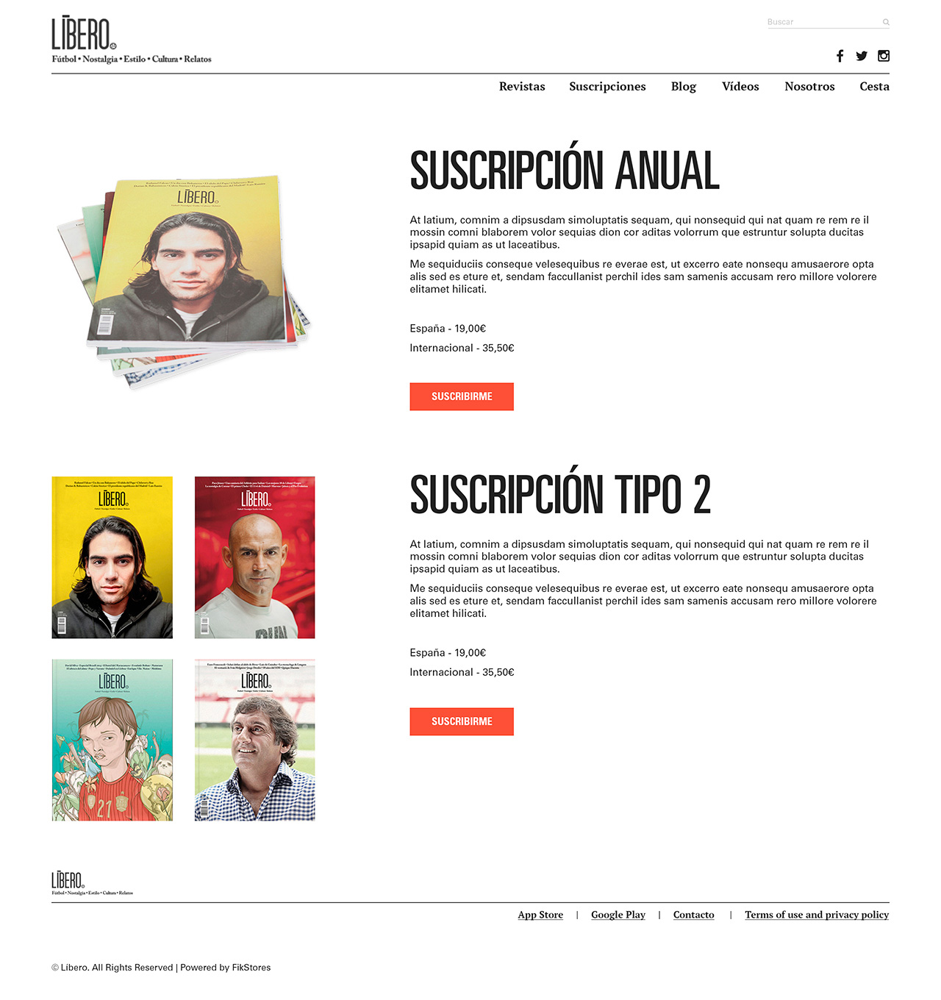
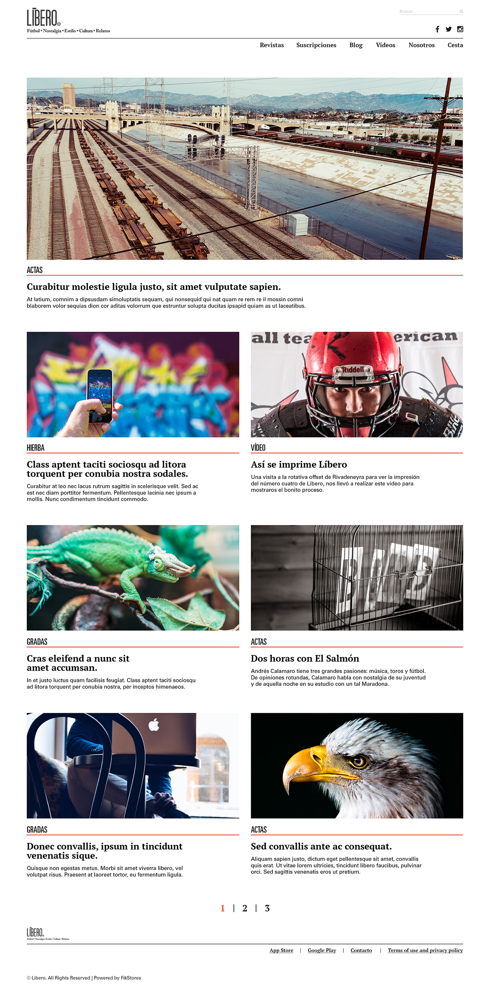
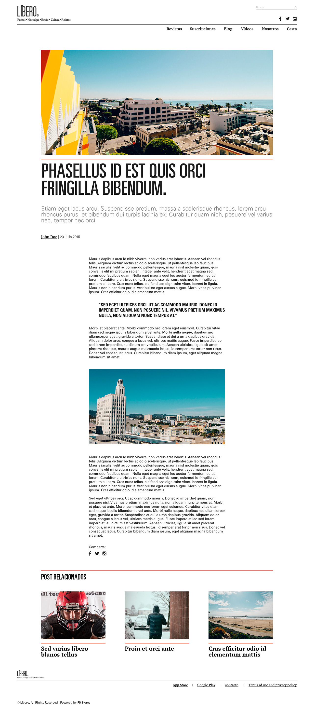
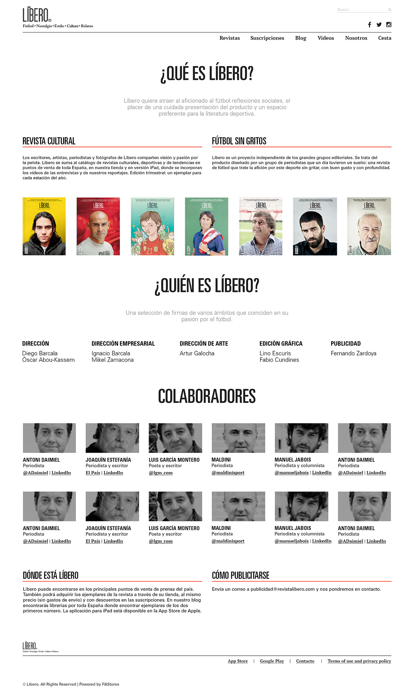

# Líbero Football Magazine, a Wordpress online store

> Wordpress Theme for Líbero Football Magazine.

----
## What this theme include?

> Líbero is the product designed by a group of journalists and entrepreneurs who one day had a dream: A football magazine that treats the fans for this sport without shouting, with good taste and depth.

> I developed the Líbero Theme, bringing the wireframes of the UX designer to life, as well as collaborating with Back End Developers to develop the different plugins, widgets and shortcodes to create a stellar finished product. A bootstrap framework based, fully responsive and mobile first layout.

----
## Go to the projects
You can see this project live going to: 

>* **[Líbero](http://libero.fikstore.com/)**

----
## Screenshots
**Home**

----

**Store**

----

**Single Product**

----

**Single Product Packs**

----

**Suscriptions**

----

**Blog**

----

----

**About us**

----
## Date
>* April-2015

----
## Company
>* [Líbero Football Magazine](https://revistalibero.com/)

----
## Agency
>* [FikStores](https://thefik.com)

